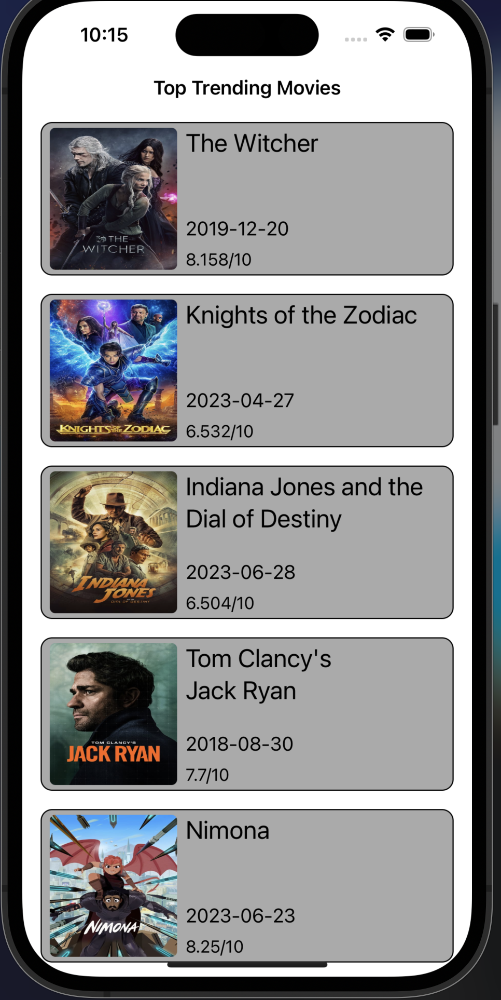
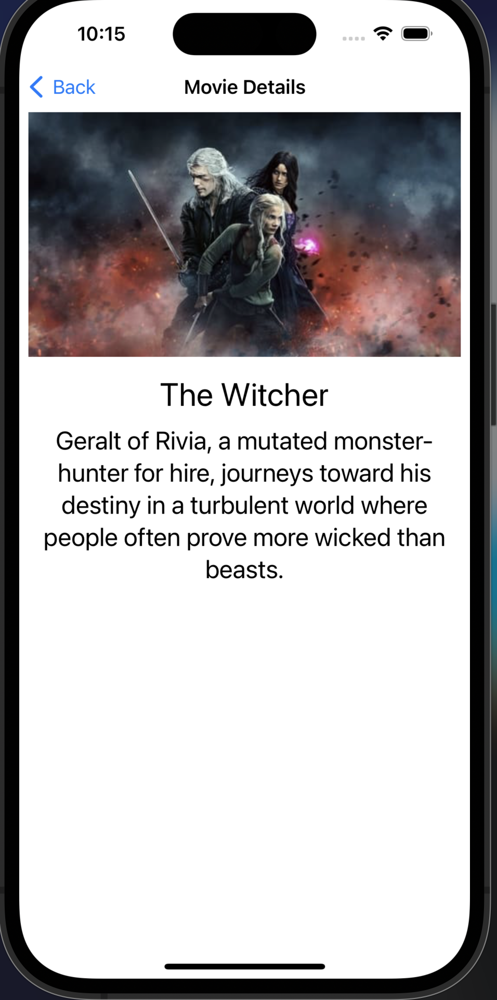

# MovieApp

<p align="center">
  
  
</p>

MovieApp is an iOS application that allows users to explore and discover trending movies. It leverages the TMDb (The Movie Database) API to fetch movie data and presents it in a visually appealing and user-friendly interface.

## Features

- **Trending Movies:** The app displays a list of the top trending movies, showcasing popular and highly-rated films.
- **Movie Details:** Users can view detailed information about each movie, including the title, description, release date, and average rating.
- **Movie Images:** High-quality images associated with each movie are loaded and displayed using the SDWebImage library.
- **Pagination:** The app supports pagination, allowing users to load more movies as they scroll through the list.
- **Responsive UI:** The user interface is designed to adapt to different screen sizes and orientations, providing a consistent experience across devices.

## Technologies Used

The MovieApp is built using the following technologies:

- **Swift:** The programming language used to develop the iOS application.
- **UIKit Framework:** The iOS framework that provides the core components and functionalities for building the user interface.
- **SDWebImage:** An open-source library that simplifies the process of loading and caching remote images in iOS apps.
- **TMDb API:** The TMDb API (The Movie Database API) is used to fetch movie data, including details and images, to populate the app with up-to-date information.

## Installation

To run the MovieApp on your local machine, follow these steps:

1. Clone the repository:
```
git clone https://github.com/Okariuss/Swift-MovieApp.git
``` 
2. Open the project in Xcode.
3. Build and run the project on a simulator or a physical device

## Configuration

To configure the project with your own TMDb API key:

1. Open the `NetworkConstant.swift` file in the project.

2. Replace the `YOUR_API_KEY` placeholder with your TMDb API key.
```
public var apiKey: String {
  get {
    //API Key here
    return "YOUR_API_KEY"
  }
}
```
   
3. Save the changes

## License

This project is licensed under the MIT License. You are free to modify, distribute, and use the code for personal and commercial purposes.

## Acknowledgements

This project acknowledges the following:

- The TMDb API for providing the movie data used in the app.
- SDWebImage library for simplifying image loading and caching.


